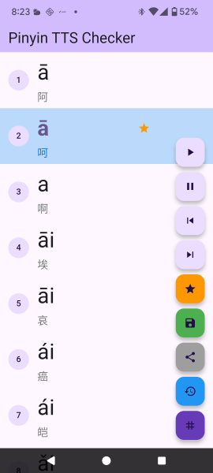

# Pinyin TTS Checker
Androidのpinyin TTSが正確かどうか調べる。

# Details
中文漢字のリストをもとにピンインと漢字を表示させ、TTSで読み上げさせる。読み上げが正しいかどうかはユーザーが聞きながら判断する。

ユーザーは読みが違うと思ったら停止ボタンで停止させて確認する。読みの間違いであれば、マークして続行する。

保存ボタンを押すと、マークした漢字のリストと現在のフォーカス位置を保存する。
復元ボタンを押すと、保存した漢字のリストとフォーカス位置を復元する。

# Screenshots

